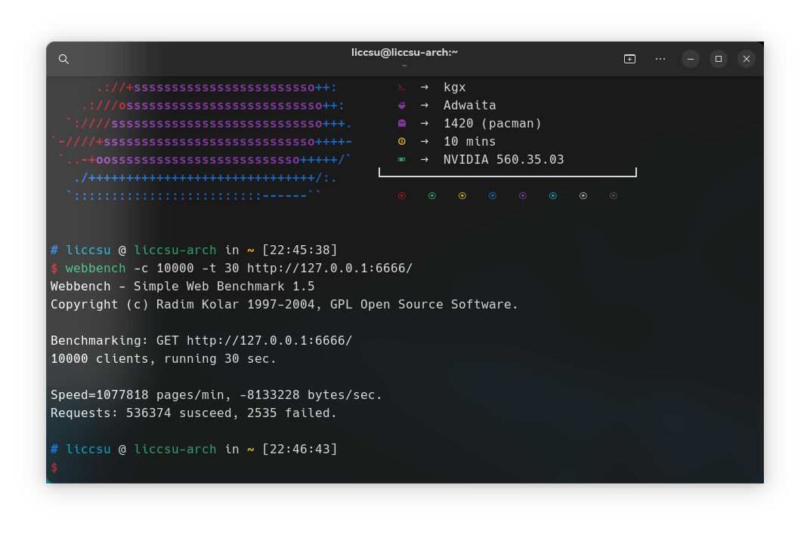
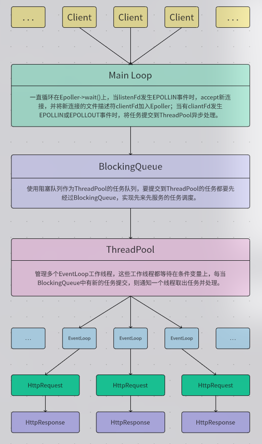
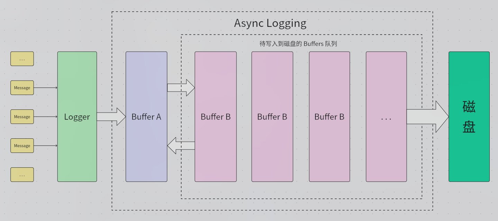

# TinyWebServer
## 简介
这是一个轻量级的、高性能的静态Web Server，使用`C++ 20`标准开发，使用`IO`多路复用和线程池实现了基于“事件分发”的多线程高并发的`Reactor`模式。支持`HTTP/1.0`和`HTTP/1.1`协议，支持`GET`和`POST`请求，具有高并发和高吞吐量，使用[WebBench](https://github.com/Liccsu/WebBench)进行`c10k`压力测试`QPS`(每秒处理请求数)达到`1.8w`，测试环境为笔记本，CPU:`AMD Ryzen 5 3550H`。


以下是程序主要结构：

另外还实现了高性能的异步日志库：
为了简化图例，图中只使用了两块`Buffer`，而实际上程序使用了四块`Buffer`，目的是为了防止前端某个时候写入太快，一下子就用完了前端的那块`Buffer`，而后端的那块`Buffer`还没空出来，导致前端没有空闲的`Buffer`可用而需要新分配缓冲区带来额外的开销，所以程序中实际上预分配了四块`Buffer`，前端和后端各有两块，多出来的一块作为预备缓冲区，虽然这还是不能彻底解决问题，但是也极大程度上的减少了前端等待空闲`Buffer`的时间（实际应用中几乎不会出现四块缓冲区都用完的情况）。

程序还使用小根堆数据结构实现了高性能的时间堆用于管理连接时长，当某个连接长时间不活跃时即断开该连接，防止“僵尸”连接占用资源。

作为扩展，程序中还实现了基于[MariaDB](https://mariadb.org/)的数据库连接池，并使用`RAII`机制来管理连接。此数据库连接池不仅支持动态扩展和收缩，还能定期进行连接健康度监测，对不可用连接尝试重连，如果重连失败则关闭该连接并建立新连接。

程序使用[YAML](http://www.yaml.org/)进行参数配置，降低硬编码。

## 构建并使用
本项目仅支持`Linux`平台，理论上支持各大`Linunx`发行版，并在`Debian12_x64`、`Ubuntu24.02_x64`、`ArchLinux_x64`上测试通过，理论上也支持`ARM`架构的`Linux`发行版（尚未测试）。

以`Ubuntu`为例：

1.更新软件包列表：
```shell
sudo apt update
```

2.安装所需依赖：
```shell
sudo apt install libmariadb-dev libmariadb-dev-compat mariadb-server libmariadb3 build-essential cmake
```

3.启动`MariaDB`服务并设置开机自启动：
```shell
sudo systemctl enable --now mariadb
```

4.克隆本仓库：
```shell
git clone --depth=1 --single-branch https://github.com/Liccsu/TinyWebServer.git
```

5.使用[CMake](https://cmake.org/)进行构建：
```shell
# 先 cd 进入本项目目录
cd TinyWebServer
# 创建用于构建输出的目录
mkdir -p build
# 配置 CMake 项目
cmake -B build
# 构建
cmake --build build --target all -j 6
# 如果需要清理构建
cmake --build build --target clean -j 6
```

6.运行：
```shell
./build/TinyWebServer
```

7.测试：
使用[WebBench](https://github.com/Liccsu/WebBench)进行`c10k`压力测试：
```shell
webbench -c 10000 -t 30 http://127.0.0.1:6666
```

# 配置
首次运行程序后，在工作目录下会生成`config`目录，编辑其中的`config.yml`来配置参数。

`config.yml`内容如下（注意配置项缺一不可！！！）：
```yaml

server:
    # 监听端口
    port: 6666
    # 连接超时时间，单位毫秒
    timeout: 60000

mysql:
    # MySQL HOST
    host: 127.0.0.1
    # MySQL PORT
    port: 3306
    # MySQL 用户名
    user: root
    # MySQL 密码
    password: 123456
    # MySQL 数据库名
    db: tiny_web_server_db
    # 数据库连接池初始大小
    pool_size: 12
    # 数据库连接池最低大小
    pool_min_size: 6
    # 数据库连接池最高大小
    pool_max_size: 24

log:
    # 日志文件输出目录
    directory: ./log
    # 日志输出级别 1:debug 2:info 3:warning 4:error 5:none
    level: 2
    # 单个日志文件大小限制，单位 MB
    size: 64
    # 日志文件名 (base name)
    basename: tiny_web_server
    # 是否输出彩色，当选择输出到文件时建议关闭
    colorful: false
    # 是否输出到文件 true:输出到文件 false:输出到终端
    output_to_file: true

site:
    # 静态网站目录
    path: ./dist

```

# 致谢
[JehanRio/TinyWebServer](https://github.com/JehanRio/TinyWebServer)

[chenshuo/muduo](https://github.com/chenshuo/muduo)
